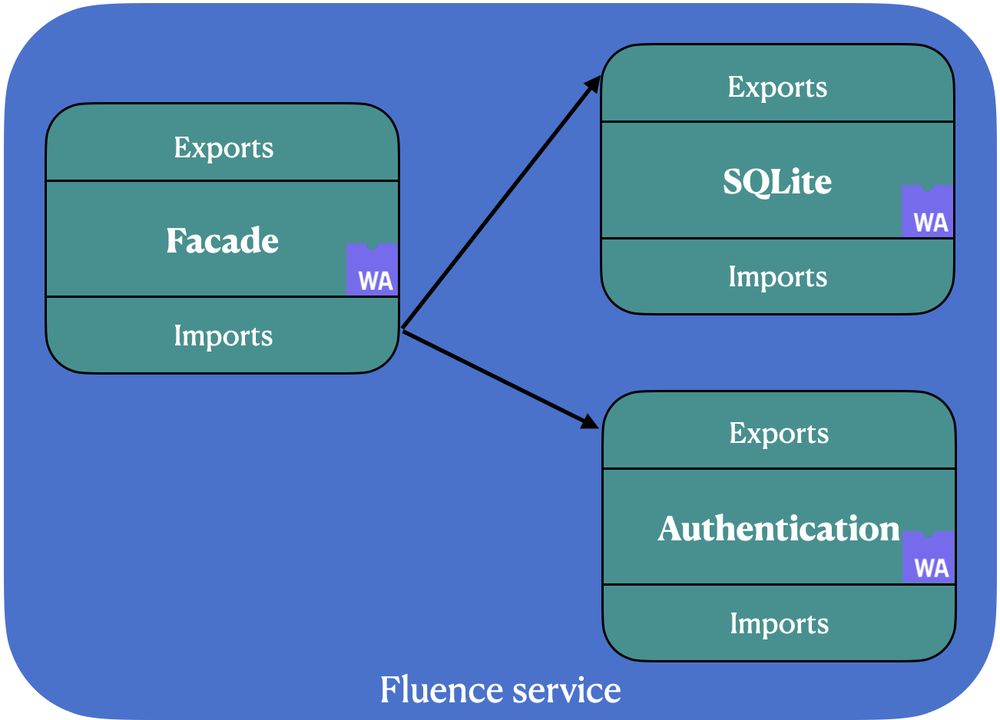

# Basic concepts

This chapter describes some basic concepts that are crucial for understanding all subsequent parts.

## Wasm Modules

[Wasm modules](https://webassembly.github.io/spec/core/syntax/modules.html) are how Wasm programs are organized, it's an essential unit of deployment, loading, and compilation.

### Marine Wasm Module
A **Marine Wasm module** (or just a Marine module) is a Wasm module compiled with the [Marine SDK](../marine-rust-sdk/marine-rust-sdk.md). These modules follow an internal convention which allow them to link with other modules (in a **module-module** scheme) or with a host (**module-host** scheme). You could find more information about the conventions in the [Marine Module ABI](../marine-rust-sdk/module-abi.md) section.

A **Host** generally refers to what runs a Wasm module, it could be a runtime or runtime and OS. In the case of a Marine host, this could be either a Rust-based or JavaScript-based Marine runtime component.

### Imports and Exports
Each Wasm module could have imports and exports. An **Import** is a definition of some external data that this module could use during its execution. A module could import functions, memories, globals, and tables. An **import** function is the only way for a module to call an external module API; Wasm modules are sandboxed by design.

Conversely, an **Export** is a definition for a module to make some data be accessible by a host or other module. Similarly to imports, a module could export functions, memories, globals, and tables.

## Fluence service

A **Fluence service** (or just service) is a group of Marine modules linked together with the *[shared-nothing](https://training.linuxfoundation.org/blog/how-and-why-to-link-webassembly-modules/)* linking scheme with help of interface-types. This scheme allows modules to encapsulate their inner state (such as memory, globals, and tables) and expose only export functions. So, modules are linked together by corresponding exports and imports functions:

In the picture above you could see an example of a Fluence service comprised of three different modules: `facade`, `SQLite`, and `authentication module`. The modules on the right are linked to the `facade` module by linking each import to a corresponding export.

Marine is one of a few Wasm runtimes that allows composing several Wasm modules in an easier manner.
